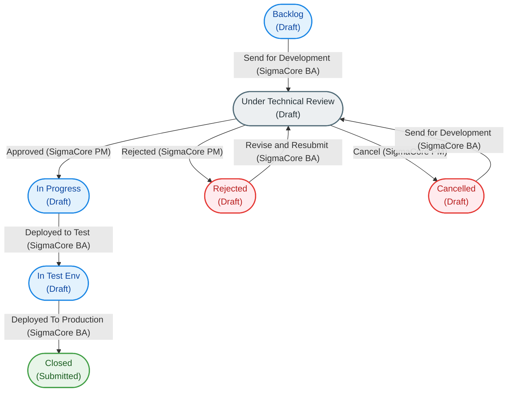

# Go-Smart SigmaCore

Unifying complex system evolution with precision and data-driven impact analysis.

---

## Overview

**Go-Smart SigmaCore** is a specialized system-engineering and lifecycle-management application built on the Frappe framework. It is engineered to bring structure, transparency, and data-driven precision to complex software system evolutions, change management, and technical validation processes.

### App Objectives
*   **Precision Change Request Management**: Facilitate the definition, tracking, and governance of system enhancements and modifications using structured Change Requests (`SigmaCore CR`).
*   **Granular Requirement & Scope Definition**: Map change requests to explicit software modules (`SigmaCore Module`), user stories, and acceptance criteria, ensuring that business value directly translates to technical delivery.
*   **Impact & Feasibility Assessment**: Provide built-in feasibility analysis tools, estimating development duration, managing constraints, and capturing stakeholder/lead approvals before implementation starts.
*   **End-to-End Governance**: Control progress through standard workflows with strictly defined role-based transitions (specifically managed by Business Analysts (`SigmaCore BA`) and Project/Technical Managers (`SigmaCore PM`)).
*   **Quality Assurance & Patch Validation**: Maintain high software quality and validation standards by systematically logging bug reports and executing rigorous test runs via `SigmaCore Patch Test Report`.

---

## SigmaCore CR Workflow

The lifecycle of a **SigmaCore Change Request (CR)** is managed via a strict, multi-stage approval workflow. This workflow guarantees that every system evolution is fully analyzed, technically vetted, and verified before hitting production.

### Workflow States
*   **Backlog**: The starting state for any new Change Request. Edited by Business Analysts (`SigmaCore BA`).
*   **Under Technical Review**: The CR is evaluated for technical feasibility, impact, and effort estimation. Edited by Project Managers (`SigmaCore PM`).
*   **In Progress**: The CR is approved for development and implementation begins. Edited by Business Analysts (`SigmaCore BA`).
*   **In Test Env**: The features have been developed and deployed to the staging/test environment for QA. Edited by Business Analysts (`SigmaCore BA`).
*   **Closed**: The change request is successfully deployed to production and finalized. This is the terminal submission state.
*   **Rejected**: The technical review deemed the CR unfeasible or incomplete. Edited by Project Managers (`SigmaCore PM`).
*   **Cancelled**: The CR was discarded during or after review. Edited by Business Analysts (`SigmaCore BA`).

### Workflow Transitions Flowchart

The following flowchart outlines the allowed state transitions and the respective roles authorized to trigger them:



---

## Installation

You can install this app using the [bench](https://github.com/frappe/bench) CLI:

```bash
cd $PATH_TO_YOUR_BENCH
bench get-app $URL_OF_THIS_REPO --branch develop
bench install-app go_smart_sigmacore
```

## Contributing

This app uses `pre-commit` for code formatting and linting. Please [install pre-commit](https://pre-commit.com/#installation) and enable it for this repository:

```bash
cd apps/go_smart_sigmacore
pre-commit install
```

Pre-commit is configured to use the following tools for checking and formatting your code:

- ruff
- eslint
- prettier
- pyupgrade

## CI

This app can use GitHub Actions for CI. The following workflows are configured:

- CI: Installs this app and runs unit tests on every push to `develop` branch.
- Linters: Runs [Frappe Semgrep Rules](https://github.com/frappe/semgrep-rules) and [pip-audit](https://pypi.org/project/pip-audit/) on every pull request.

## License

mit

